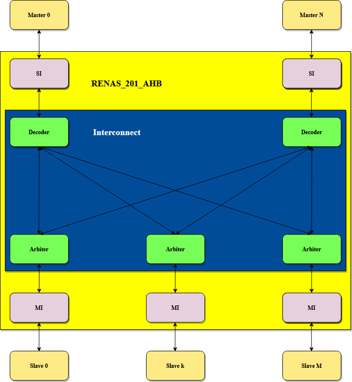
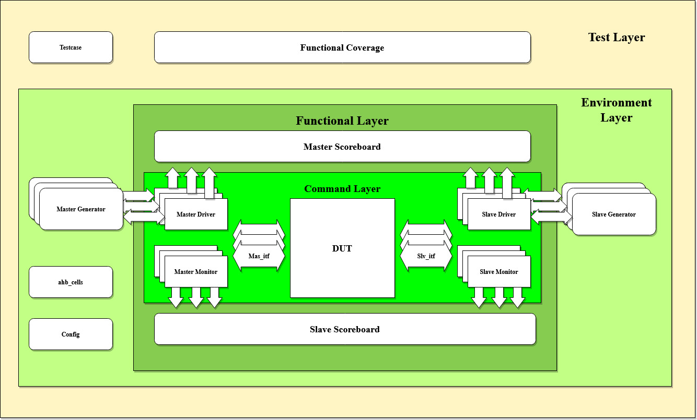

# An AHP Bus Generator From my Thesis Proposal in HCMUT
* AHB Gen

* Constraint Random Verification Environment

* 31-03-2021: Bug found
  + Missing pready to slaves (add pready to all slaves)
  + CRV environment should be modify to sample & checking the correct data (driver, monitor)
